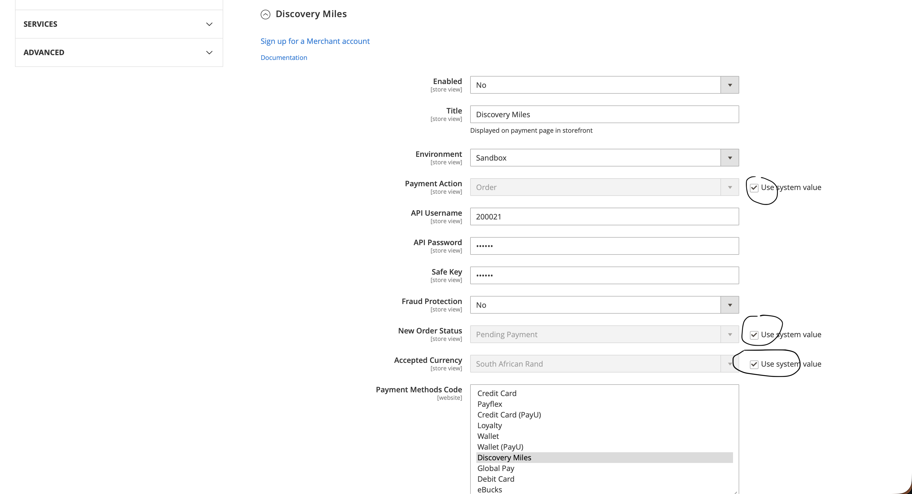

# PayU MEA Magento v2.4+ payment module #

This guide details how to install the PayU MEA payment module for Magento v2.4+. Plugin was tested on Magento v2.4+

## Prerequisites
* Magento 2.4.4 and above
* PHP 8.1
* SSH access to server hosting Magento application

## Dependencies

In addition to Magento system requirements, this extension requires the following PHP extensions in order to work properly:

- [`soap`](https://php.net/manual/en/book.soap.php)
- [`xml`](https://php.net/manual/en/book.xml.php)

## Installation

### Via Composer

You can install the extension via [Composer](http://getcomposer.org/). Run the following command:

```bash
composer require payumea/gateway-magento
```
or add
```bash
payumea/gateway-magento: "*"
```
to the **require** section of your composer.json and run `composer update`. To enable extension after installation you need to execute the following command in the root directory of your magento application.

```bash
php bin/magento module:enable --clear-static-content PayU_Gateway
php bin/magento setup:upgrade
php bin/magento setup:di:compile
php bin/magento setup:static-content:deploy
php bin/magento cache:clean
```

### from GitHub repository

1) Download latest tagged version of plugin from GitHub repository
2) Unpack the downloaded archive
3) Create a *PayU/Gateway* directory inside *app/code/* directory
4) Copy the files from *"gateway-magento-main"* directory you just unpacked in step 2 above to your Magento 2.4 application inside the directory *app\code\PayU\Gateway*.

After copying the files you need to enable the extension by executing the following command from the root directory of your magento application:
```bash
php bin/magento module:enable --clear-static-content PayU_Gateway
php bin/magento setup:upgrade
php bin/magento setup:di:compile
php bin/magento setup:static-content:deploy
php bin/magento cache:clean
```

## Configuration
To configure the extension, you have to navigate to **Stores > Configuration > Sales > Payment Methods** and find PayU Gateway
extension listed among ***Recommended Payment Methods***

When configuring any payment method please remember to uncheck the "Default" setting on every option for the given payment method and choose specific value from a dropdown menu:


## Caching

The PayU Gateway module now includes built-in caching for transaction data retrieved from the PayU SOAP web service. This feature helps reduce latency by caching responses for 1 hour.

### Cache Type

The module registers a custom cache type called "PayU Gateway" which can be managed through Magento's cache management system:

- **Cache Type Code**: `payu_gateway`
- **Cache Tag**: `PAYU_GATEWAY`
- **Default TTL**: 1 hour (3600 seconds)

### Managing the Cache

You can manage the PayU Gateway cache using Magento's standard cache management commands:

```bash
# Clean the PayU Gateway cache
php bin/magento cache:clean payu_gateway

# Flush the PayU Gateway cache
php bin/magento cache:flush payu_gateway

# Disable the PayU Gateway cache
php bin/magento cache:disable payu_gateway

# Enable the PayU Gateway cache
php bin/magento cache:enable payu_gateway
```

The cache will automatically refresh when:
- The cached data expires (after 1 hour)
- You manually clean or flush the cache
- New transaction data is requested that isn't yet in the cache

### Technical Implementation

The caching mechanism is implemented in the `PayUAdapter::search()` method which:
1. Generates a cache key based on the PayU reference
2. Attempts to load data from cache first
3. If not found, makes the SOAP web service call to retrieve transaction data
4. Stores the response in cache with a 1-hour expiration
5. If found in cache, deserializes the data and returns it

The cache uses Magento's standard cache frontend interface and serializer for data storage and retrieval.

## Available payment methods
 - Airtel Money
 - Capitec Pay
 - Credit card
 - Discovery Miles
 - eBucks
 - EFT (Ozow)
 - Mobicred
 - Payflex
 - Equitel
 - Fasta
 - Mobile banking
 - MoreTyme
 - Mpesa
 - Mtn Mobile
 - Rcs
 - Rcs Plc
 - Tigopesa
 - Ucount

For Kenyan payment methods (Mpesa, Equitel, Airtel Money, Mobile Banking) - configuration in **Stores > Configuration > Customers > Customer Configuration > Name and Address Options > Show Telephone** must be set to "Required"
